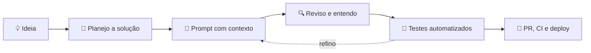

<div align="center">


<a href="https://eric-rodrigues.vercel.app">
  
</a>

<br/><br/>

[](https://eric-rodrigues.vercel.app)
[](https://linkedin.com/in/eric-rodrigues-dev)
[](mailto:ericaugust2006@gmail.com)


</div>

---

## 👨‍💻 Sobre mim

```ts
const eric = {
  nome: "Eric Augusto da Silva Rodrigues",
  papel: "Desenvolvedor Fullstack",
  base: "Vila Velha, ES 🇧🇷",
  stackPrincipal: ["React", "Next.js", "TypeScript", "Tailwind CSS"],
  backend: ["Node.js", "PostgreSQL", "MongoDB", "Docker", "CI/CD"],
  paralelo: "Diretor e programador em um estúdio de jogos indie 🎮",
  formacao: "Análise e Desenvolvimento de Sistemas (cursando)",
  idiomas: { portugues: "nativo", ingles: "intermediário" },
  buscando: "Primeira vaga como Júnior ou Estagiário 🚀",
};
```

Sou um desenvolvedor com forte domínio de **JavaScript e TypeScript**, focado em criar **interfaces web modernas, responsivas e acessíveis** com React e Next.js. Gosto de componentes reutilizáveis, integração de APIs, gerenciamento de estado e código limpo. Também domino o back-end com **Node.js e bancos de dados**, o que me ajuda a conversar com times full stack e entregar soluções mais completas, estáveis e escaláveis.

---

## 🧭 Minha jornada

| Quando | O que aconteceu |
|:---:|---|
| 🌱 **Ensino médio** | Primeiro contato com programação: estudei JavaScript sozinho com cursos gratuitos da Rocketseat e do YouTube |
| 🎮 **2023 – 2024** | Curso técnico em **Programação de Jogos Digitais** (CEET Vasco Coutinho): lógica, Unity e C#. Assumi a **liderança** dos trabalhos em grupo |
| 🏢 **Estúdio indie** | Aquele grupo virou um **estúdio de jogos independente** que participa de editais estaduais até hoje |
| 🎓 **2026** | Ingresso em **Análise e Desenvolvimento de Sistemas** na Multivix |
| 💼 **Hoje** | Concilio trabalho, faculdade e projetos pessoais, com foco total na minha **primeira vaga na área** |

---

## 🛠️ Stack & Habilidades

<div align="center">


</div>

<br/>

<details open>
<summary><b>🌐 Front-End</b></summary>
<br/>

- **Base:** HTML, CSS, JavaScript, TypeScript
- **Frameworks e libs:** React, Next.js, Tailwind CSS, ShadcnUI
- **Estado e dados:** Context API, TanStack Query, Axios
- **Foco:** componentes reutilizáveis, interfaces responsivas e acessíveis, performance

</details>

<details>
<summary><b>⚙️ Back-End</b></summary>
<br/>

- **Runtime e frameworks:** Node.js, Next.js API Routes, Express, Fastify
- **ORMs e validação:** Prisma, Drizzle ORM, Zod
- **Bancos:** PostgreSQL, MongoDB, SQLite
- **Práticas:** APIs RESTful, autenticação, segurança de dados, migrations versionadas (node-pg-migrate)

</details>

<details>
<summary><b>🚀 DevOps & Qualidade</b></summary>
<br/>

- **Containers:** Docker, Docker Compose
- **CI/CD:** GitHub Actions com proteção de branch (merge só com testes aprovados)
- **Testes:** Jest e testes de integração automatizados
- **Versionamento e deploy:** Git, GitHub, Vercel

</details>

<details>
<summary><b>🎮 Game Dev</b></summary>
<br/>

- **Engine e linguagem:** Unity, C#
- **Papel:** direção de jogo, programação de mecânicas e liderança de equipe de arte
- **Ferramentas:** Git, GitHub, UI System

</details>

---

## 🏗️ Projetos em destaque

### ⏱️ Sistema de Ponto
Controle de ponto para funcionários, com cadastro, **autenticação por sessão** e **senha criptografada**. Foco em práticas profissionais de back-end: migrations versionadas, testes de integração e pipeline de **CI/CD** com GitHub Actions, incluindo proteção de branch.


### 🍗 Galetittos Website
Site para uma **galeteria real**, focado em divulgar promoções e atrair clientes. O projeto **aumentou a média de visitas aos domingos**, e o dono expandiu o estoque e ampliou o lucro mensal do estabelecimento. 💰


### ✍️ MyLorant: Blog Page
Plataforma de **blog multiusuário** com autenticação, criação e gestão de postagens, sistema de curtidas e organização de conteúdo, pensada para escalar.


### 🔗 Conversor de Links
App fullstack que **uso no meu dia a dia profissional** para salvar e organizar links. Feito do zero para praticar PostgreSQL serverless (Neon), **Server Actions** e App Router do Next.js e UI com ShadcnUI.


### ⚡ Pokémon Search
Busca e consulta de dados da PokéAPI. Prática de **rotas no React**, requisições com Axios, estados de loading e erro, tipagem em TypeScript e estilo responsivo.


<div align="center">

📂 **[Veja todos os repositórios →](https://github.com/EricAugust2006?tab=repositories)** &nbsp;|&nbsp; 🌐 **[Portfólio completo →](https://eric-rodrigues.vercel.app)**

</div>

---

## 🎮 Além do código: Game Dev

Sou **diretor e programador** em um estúdio de jogos indie que nasceu no curso técnico.

| Jogo | Sobre | Destaque |
|---|---|---|
| 🌸 **Valentina** (2D) | Game Jam com o tema *"Barreiras"*. Liderei a equipe de arte e programei as mecânicas principais | 🏆 Participando do edital estadual **Funcultura** de Protótipo de Jogos Digitais |
| 🌿 **Não Pise No Meu Jardim** (2D) | Game Jam com o tema *"Botânica"*, depois aprimorado como **projeto de conclusão** do curso técnico | 🎓 TCC no CEET Vasco Coutinho |


> 💡 Liderar equipe de arte, cumprir prazo de game jam e entregar para edital me deram **comunicação, organização e trabalho em equipe** que levo para o desenvolvimento web.

---

## 🎓 Formação & Certificações

**Acadêmica**
- 🎓 **Análise e Desenvolvimento de Sistemas**: Multivix, Vila Velha (2026, cursando)
- 🎮 **Programação de Jogos Digitais**: CEET Vasco Coutinho (2023 – 2024)
- 🖥️ **Informática e Manutenção**: Evolução Mutz (2023 – 2024)

**Certificações e cursos**

| Curso | O que estudei |
|---|---|
| 🌐 **curso.dev**: Formação em Desenvolvimento Web | JS/TS, Git e GitHub, front-end e back-end, APIs e fluxo de trabalho profissional |
| 🚀 **Full Stack Club**: Formação Full Stack | React, Next.js e Node.js com foco em projetos reais |
| ⚡ **NLW Pocket**: JavaScript Full-stack | Fastify, Drizzle ORM, PostgreSQL, Docker, Zod, React, TanStack Query |
| 🧳 **NLW Journey**: Node.js | API REST em TypeScript, Fastify, Prisma, SQLite e Zod |
| 🧳 **NLW Journey**: React.js | Componentização, estados, TypeScript, Vite, Tailwind e consumo de API |

---

## 🤖 Desenvolvimento com IA

Uso IA como **copiloto**, não como piloto automático: ela acelera meu aprendizado, mas eu continuo entendendo, revisando e decidindo o que entra no código.



- 🎯 **Prompts claros:** contexto, restrições e resultado esperado
- 🐛 **Debug assistido:** descrevo o erro, o que já tentei e o comportamento esperado
- 📖 **Aprendizado ativo:** peço o *porquê*, não só o *como*
- 🧪 **Qualidade:** testes e pipeline de CI garantem que nada entra sem passar

---

## 📊 Estatísticas do GitHub

<div align="center">


<br/>


</div>

---

## 🤝 Vamos conversar?

Estou pronto para minha **primeira vaga como Desenvolvedor Júnior ou Estagiário** e aberto a colaborações e projetos open source. Se meu perfil faz sentido para o seu time, vou adorar bater um papo!

<div align="center">

[](https://eric-rodrigues.vercel.app)
[](https://linkedin.com/in/eric-rodrigues-dev)
[](mailto:ericaugust2006@gmail.com)

<br/>

### ✨ “Aprender, criar e evoluir — um commit de cada vez.” ✨


</div>
